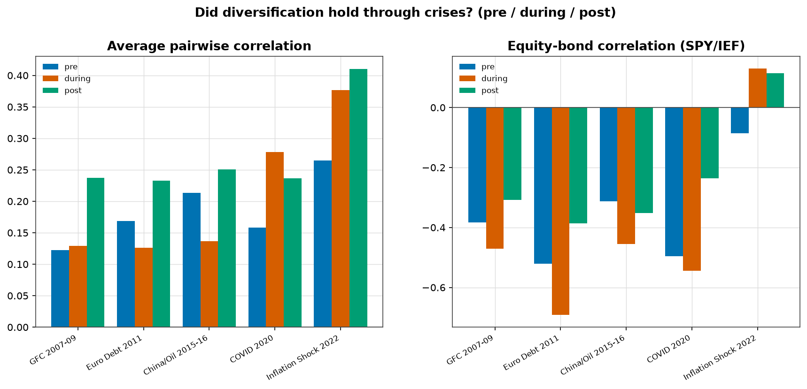
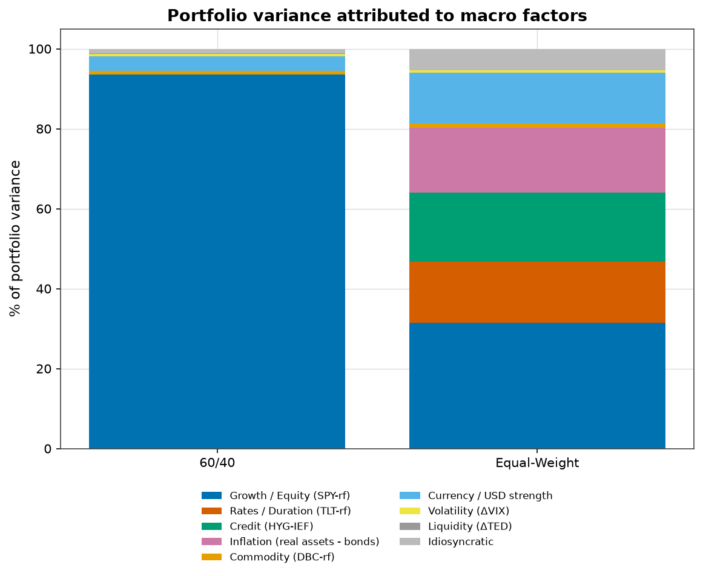
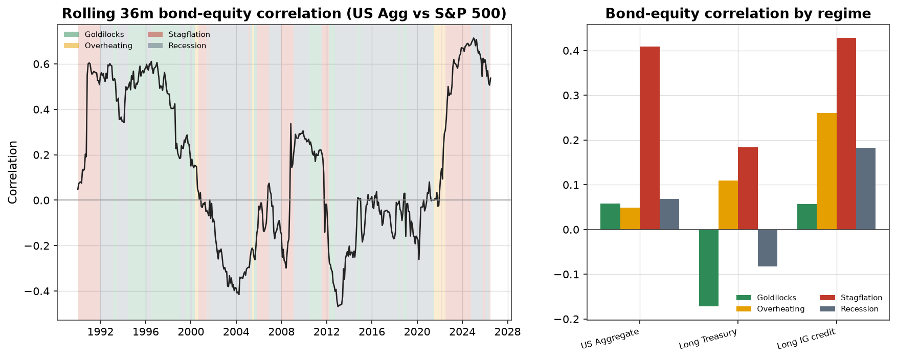

# Regime-Aware Strategic Asset Allocation

Does identifying macroeconomic **regimes** — and adjusting expected returns, volatilities, correlations and weights accordingly — improve portfolio outcomes versus a static strategic asset allocation (SAA)? This repo answers that end-to-end on **real historical data** (Financial Modeling Prep): transparent regime detection, asset behaviour by regime, macro risk-factor decomposition, a costed out-of-sample backtest, crisis stress tests, currency-hedging analysis, and a practical implementation framework.

The methodology is deliberately **simple-first**: a four-quadrant Growth × Inflation model is the core; HMM/clustering are supplementary robustness checks. **No simulated or synthetic data is used anywhere** — the only resampling is a block bootstrap of observed returns.

📄 **Full report:** [`reports/report.md`](reports/report.md) · **Executive summary:** [`reports/executive_summary.md`](reports/executive_summary.md)

---

## Headline results

Static vs regime-aware strategies, 15-asset global universe, 2005–2026, net of 10 bps costs, point-in-time:

| Strategy | Ann. return | Vol | Sharpe | Max drawdown |
|---|---:|---:|---:|---:|
| 60/40 (US) | 8.1% | 9.0% | 0.71 | −28.9% |
| ERC / Risk Parity | 4.9% | 6.6% | 0.49 | −19.6% |
| Max-Sharpe (MVO) | 5.6% | 6.4% | 0.62 | −14.7% |
| **Regime Risk Overlay** | 4.6% | 5.8% | 0.51 | **−15.0%** |

**Three conclusions:**

1. **Diversification is regime-dependent.** The equity–bond correlation flips from **−0.55 (Goldilocks)** to **positive in inflation regimes** — and in the **2022 inflation shock the hedge broke** (corr +0.13; bonds −34%, only commodities rose +21%) while it held through the GFC, Euro, China and COVID crises.
2. **60/40 is ~95% one (equity) risk factor** — "balanced" by capital, not by risk.
3. **Regime awareness pays as risk management, not alpha.** A transparent de-risking overlay cut max drawdown ~24% (and the GFC drawdown from −19.6% to −10.9%, COVID to −1.2%), but the Sharpe improvement is **not statistically significant** — an honest result the report does not overstate.

> **Full-period robustness (1990–2026, report §12.7):** rebuilt on real long-history fund proxies, the conclusions hold over 36 years and seven crises. 60/40's Sharpe edge narrows and it carries **~double the drawdown** (−32.1% vs ~−16%); on **Calmar (return per unit of drawdown) every diversified strategy beats 60/40**. The dot-com bust is diversification's finest hour (60/40 −23% vs risk-parity −1%).

<p align="center">
  
  
</p>

### Fixed-income deep dive (1980–2026, real long-history data)

A companion analysis extends to **~1980–2026** using real long-history bond mutual-fund total returns and macro back to 1950 — capturing the **Great Inflation/Volcker era** so the fixed-income conclusions rest on real inflation-regime data, not just 2022. Key results (`reports/fixed_income/`, report §12.6):

- The **bond–equity hedge fails in Stagflation across 45 years** (US-aggregate/equity correlation +0.41 in Stagflation vs ~0 elsewhere) — confirming 2022 was a regime feature, not a fluke.
- **Duration is the dominant fixed-income lever** (long − short Treasury ≈ +8%/yr in Goldilocks, −4%/yr in Overheating); **credit/high-yield lag in Stagflation** (not defensive); **unhedged global bonds lag US ~9%/yr in Overheating** (strong dollar); **TIPS hedge inflation surprises but not the 2022 real-rate shock**.

<p align="center">
  
</p>

---

## Quick start

Requires Python ≥ 3.11, [uv](https://docs.astral.sh/uv/), and a free/premium [FMP](https://site.financialmodelingprep.com) API key.

```bash
cp .env.example .env        # add FMP_API_KEY
uv sync --extra advanced
uv run python -m raa.data.collect        # macro + prices + market panels (cached)
uv run python -m raa.analysis.phase1     # rule-based regimes + per-regime stats
uv run python -m raa.analysis.phase2     # risk factors + supplementary regimes
uv run python -m raa.analysis.phase3     # portfolios, backtest, crisis, currency, validation
uv run python -m raa.analysis.sensitivity
```

FMP responses are cached under `data/cache/`, so re-runs are instant and offline-friendly.

---

## Repository structure

```
config/            universe.yaml (asset proxies, FX, cash)
src/raa/
  utils/           config, logging, I/O, plotting style
  data/            cached FMP client; macro, price, market collectors
  regimes/         rule-based (core), HMM/clustering, market-implied
  factors/         8-factor construction + decomposition
  portfolio/       optimisers + point-in-time backtest engine
  analysis/        metrics, by-regime stats, phase runners, crisis, currency, validation, sensitivity
  reporting/       shared chart helpers
figures/           publication-quality charts (phase1/2/3)
reports/           report.md, executive_summary.md, result tables (CSV)
tests/             pytest suite
```

---

## Methodology summary

- **Regimes:** Growth × Inflation quadrants (Goldilocks / Overheating / Stagflation / Recession) from CPI and industrial-production trends vs a point-in-time expanding-median threshold, lagged for publication delay. Supplementary: Gaussian HMM, K-means/GMM/hierarchical clustering, market-implied risk-on/off (VIX + FX vol + funding spread).
- **Universe:** liquid USD-listed ETF total-return proxies for global equities, three Treasury durations, IG/HY credit, infrastructure, REITs, commodities and gold.
- **Factors:** growth, rates, credit, inflation, commodity, currency (tradable) + volatility, liquidity (indicators); 89% average R².
- **Backtest:** static (60/40, equal-weight, inverse-vol, ERC, min-variance, max-diversification, MVO) vs regime-aware (regime ERC/min-var/max-Sharpe + a de-risking overlay); transaction costs, turnover, quarterly rebalancing, regime-confirmation lag, look-ahead and survivorship controls.
- **Validation:** block bootstrap of real returns for Sharpe confidence intervals and difference tests; sensitivity to threshold method, de-risk strength, costs and confirmation lag.

See [`reports/report.md`](reports/report.md) for the complete treatment, all figures, and the implementation framework.

---

## Data sources

| Domain | Source |
|---|---|
| Asset prices (total return) | FMP `historical-price-eod/dividend-adjusted` |
| Macro (CPI, IP, GDP, unemployment, fed funds) | FMP `economic-indicators` |
| Treasury curve | FMP `treasury-rates` |
| VIX, FX | FMP EOD / forex |

## Limitations (summary)

ETF proxies span 1993–2026 (full universe from 2005), covering four crises but only ~1.5 inflation regimes; regimes are US-anchored; ETF proxies differ from indices; per-country bond curves are incompletely represented (documented, not hidden); 60/40's strong showing is partly US-equity outperformance in this era. Full discussion in the report.

## License & disclaimer

MIT — see [LICENSE](LICENSE). Research/educational project; **not investment advice**. ETF proxies represent asset classes and differ from underlying indices in fees, tracking and currency treatment.
