# Regime-Aware Strategic Asset Allocation
### An Institutional Research Study

**Author:** Daniel Jackson
**Date:** June 2026
**Status:** Full research report

> *Does explicitly identifying macroeconomic regimes — and adjusting expected returns, volatilities, correlations and portfolio weights accordingly — improve portfolio outcomes versus traditional static strategic asset allocation (SAA)?*

This report is fully self-contained: it presents the data, methodology, every result, and a practical implementation framework, with all figures and tables embedded. **All analysis uses real historical data sourced from Financial Modeling Prep (FMP). No simulated or synthetic data is used anywhere**; the only statistical resampling is a block bootstrap of *observed* returns, clearly labelled as such.

---

## Table of contents

1. [Executive summary](#1-executive-summary)
2. [Introduction](#2-introduction)
3. [Literature review](#3-literature-review)
4. [Data](#4-data)
5. [Methodology](#5-methodology)
6. [Regime detection](#6-regime-detection)
7. [Asset-class behaviour across regimes](#7-asset-class-behaviour-across-regimes)
8. [Correlation analysis](#8-correlation-analysis)
9. [Risk-factor decomposition](#9-risk-factor-decomposition)
10. [Portfolio construction](#10-portfolio-construction)
11. [Backtesting](#11-backtesting)
12. [Results](#12-results)
13. [Sensitivity analysis](#13-sensitivity-analysis)
14. [Practical implementation](#14-practical-implementation)
15. [Limitations](#15-limitations)
16. [Conclusion](#16-conclusion)
17. [References](#17-references)
18. [Appendix](#18-appendix)

---

## 1. Executive summary

Traditional strategic asset allocation (SAA) fixes expected returns, volatilities and correlations at long-run averages and holds weights roughly constant. This study asks whether conditioning those inputs on the **macroeconomic regime** — defined simply and transparently — produces materially better, *implementable* portfolio outcomes. We deliberately lead with a simple four-quadrant Growth × Inflation model and treat machine-learning methods (HMM, clustering) as supplementary, establishing first that the simple regime relationships exist in the data before adding complexity.

**Five findings stand out:**

1. **Asset behaviour is strongly regime-dependent.** Equities earn a Sharpe of **0.82 in Goldilocks** and **1.03 in Recession/recovery** but **−0.17 in Stagflation**; long Treasuries earn **1.03 in Goldilocks** but **−0.54 in Overheating**; gold earns **1.12 in Stagflation**; commodities **1.09 in Overheating**. The cross-sectional ranking of asset classes reshuffles meaningfully across regimes.

2. **Diversification is regime-dependent and weakest exactly when inflation is the problem.** The equity–bond correlation is **−0.55 in Goldilocks** but turns **positive (+0.13 to +0.16) in the inflation regimes** (Overheating, Stagflation). Average pairwise correlation across asset classes rises from **0.22 (Goldilocks) to 0.40 (Stagflation)**.

3. **The 2022 inflation shock is the modern proof.** Across the GFC, the European debt crisis, the 2015–16 China/oil scare and the COVID crash, the equity–bond hedge *held* (correlations −0.45 to −0.69 during each event). In the **2022 inflation shock it broke (+0.13)** — stocks and bonds fell together, and the only asset that rose was commodities (**+20.9%** while long Treasuries fell **−34%**).

4. **A "balanced" 60/40 fund is not balanced by risk.** A 60/40 portfolio derives roughly **95% of its variance from a single (equity/growth) factor**. A globally diversified equal-weight portfolio spreads risk across growth (31%), rates (15%), credit (17%) and inflation (16%) factors.

5. **Regime awareness pays as risk management, not as alpha.** Conditioning the *covariance* on the regime adds essentially nothing (Regime risk-parity Sharpe 0.48 ≈ static 0.48); conditioning *expected returns* (regime mean-variance) actually *hurts* after turnover. But a transparent **"de-risk in adverse regimes" overlay reduced maximum drawdown by ~26%** (−15.1% vs −20.5% for its risk-parity base) and cut the GFC drawdown from −20.5% to **−11.3%** and the COVID drawdown to **−1.5%**, with low turnover and robustness to costs. The Sharpe improvement, however, is **not statistically significant** on 21 years of data.

**Recommendation.** Use simple regimes to (a) **stress-test SAA correlation and diversification assumptions** — particularly to stop relying on the equity–bond hedge in inflationary regimes — and (b) run a **modest, rules-based risk overlay** that de-risks into real assets/defensives in adverse regimes. Do **not** use regimes to forecast returns or to justify aggressive tactical timing: the data do not support a reliable Sharpe gain, and the complexity is not warranted.

---

## 2. Introduction

Strategic asset allocation is the single most important decision most institutional investors make: studies routinely attribute the majority of portfolio return variation to the policy allocation rather than to security selection or tactical timing. Yet the standard SAA process embeds a strong assumption — that the *joint distribution* of asset returns (means, volatilities and, critically, correlations) is stable enough to be summarised by long-run averages.

The empirical record suggests otherwise. Volatility clusters; correlations move; and the diversification that an SAA relies upon appears to weaken in exactly the environments where it is most needed. If those shifts line up with identifiable macroeconomic states, then a *regime-aware* process — one that adjusts its inputs and possibly its weights as the macro environment changes — could improve outcomes.

This project tests that proposition end-to-end, for a globally diversified institutional asset universe, from a USD investor's perspective. It is designed around a specific methodological stance: **simple, transparent and robust beats complex and fragile.** A result an investment committee can understand and that survives out-of-sample, costed testing is more valuable than a black-box model with marginally better in-sample fit. Accordingly, the core framework is a four-quadrant Growth × Inflation model; HMMs and clustering are run only to check whether more elaborate methods change the conclusions (they do not).

The research questions are:

1. Do macro regimes materially affect diversification assumptions?
2. Do correlations change enough to justify regime-aware allocation?
3. Does a regime-aware portfolio outperform a static allocation out-of-sample, net of costs?
4. Which asset classes benefit most from regime-aware positioning?
5. Which risk factors dominate each regime?
6. Is the implementation complexity justified by the improvement?

---

## 3. Literature review

This study sits at the intersection of several literatures:

- **The Investment Clock / regime rotation.** The Merrill Lynch *Investment Clock* (Trevor Greetham and colleagues) maps the business cycle onto a Growth × Inflation grid and rotates asset preferences accordingly (bonds → stocks → commodities → cash). Our four-quadrant model is a transparent, point-in-time formalisation of the same intuition.

- **Risk parity and "all-weather" investing.** Bridgewater's All Weather and the broader risk-parity literature (e.g., Qian on risk contributions; Maillard, Roncalli & Teïletche on equal risk contribution) argue that capital-weighted "balanced" funds are dominated by equity risk and that balancing *risk* across environments is more robust. Our factor decomposition quantifies exactly this for 60/40.

- **Regime-switching models.** Hamilton's Markov-switching framework and its asset-allocation applications (Ang & Bekaert, *International Asset Allocation with Regime Shifts*; Guidolin & Timmermann) show that returns, volatilities and correlations differ across latent states. We implement a Gaussian HMM as a supplementary check.

- **Turbulence and regime shifts.** Kritzman & Li (*Skulls, Financial Turbulence, and Risk Management*) and Kritzman, Page & Turkington introduce statistical measures of market stress; our market-implied regime (VIX + FX vol + funding spread) is in this spirit.

- **Expected returns and the cycle.** Ilmanen (*Expected Returns*) documents how asset risk premia vary with macro conditions and valuations, motivating conditioning — while cautioning on estimation error.

- **The equity–bond correlation literature.** A growing body of work (e.g., research from AQR, PIMCO and academics) links the sign of the stock–bond correlation to the inflation regime: negative when growth shocks dominate (bonds hedge equities), positive when inflation shocks dominate. Our crisis analysis provides a clean illustration in the 2022 episode.

- **Backtest reliability.** Bailey & López de Prado (*The Deflated Sharpe Ratio*; *Pseudo-Mathematics and Financial Charlatanism*) and White's *Reality Check* warn against data-mined strategies. We respond by pre-specifying a small strategy set, testing out-of-sample and net of costs, and bootstrapping the *difference* in Sharpe ratios rather than reporting a single in-sample number.

---

## 4. Data

All series are real historical data from **Financial Modeling Prep (FMP)**, retrieved through a cached, rate-limited, retrying client and stored as reproducible parquet panels.

### 4.1 Asset universe

We represent each asset class with a liquid, USD-listed ETF and use **dividend-adjusted (total-return)** prices. The USD listing means foreign-asset returns embed currency moves (addressed explicitly in §12.4). The universe and the first reliable date for each series:

| Class | Ticker | Proxy | From |
|---|---|---|---|
| US equities | SPY | S&P 500 | 1993 |
| Australian equities | EWA | MSCI Australia | 1996 |
| UK equities | EWU | MSCI UK | 1996 |
| European equities | IEV | S&P Europe 350 | 2000 |
| Japanese equities | EWJ | MSCI Japan | 1996 |
| EM equities | EEM | MSCI EM | 2003 |
| US Treasuries (short) | SHY | 1–3y | 2002 |
| US Treasuries (intermediate) | IEF | 7–10y | 2002 |
| US Treasuries (long) | TLT | 20y+ | 2002 |
| Intl Treasuries ex-US | BWX | DM ex-US govt | 2007 |
| IG credit | LQD | US investment grade | 2002 |
| High-yield credit | HYG | US high yield | 2007 |
| Global infrastructure | IGF | listed infrastructure | 2007 |
| Global REITs | RWO | global property | 2008 |
| US REITs | VNQ | US property | 2004 |
| Commodities | DBC | broad DBIQ | 2006 |
| Gold | GLD | gold bullion | 2004 |
| Cash | BIL | 1–3m T-bills | 2007 |

The **full universe shares a common sample from ~2008**; a longer **core subset** runs from ~2004; SPY reaches back to 1993. The portfolio backtest uses a 15-asset multi-asset subset (equities, the three Treasury durations, IG/HY credit, infrastructure, REITs, commodities, gold).

### 4.2 Macro and market data

| Domain | Source | Frequency | From |
|---|---|---|---|
| CPI, industrial production, real GDP, unemployment, fed funds | FMP `economic-indicators` | monthly/quarterly | 1990 |
| Treasury curve (3m–30y) | FMP `treasury-rates` | daily | 1990 |
| VIX (equity implied vol) | FMP `historical-price-eod` | daily | 1990 |
| FX (AUD/GBP/EUR/JPY vs USD) | FMP forex EOD | daily | 1990 |
| 3-month CD rate (funding/TED proxy) | FMP `economic-indicators` | monthly | 1990 |

The EOD endpoint caps responses at ~5,000 bars; we paginate the cursor backwards to recover full history. The risk-free rate is the 3-month constant-maturity Treasury yield converted to a monthly return.

---

## 5. Methodology

The pipeline runs in four stages:

1. **Regime detection** — primary: rule-based Growth × Inflation quadrants; supplementary: Gaussian HMM, K-means/GMM/hierarchical clustering, and a market-implied risk-on/off model.
2. **Conditional statistics** — annualised return, volatility, Sharpe/Sortino, drawdown, VaR/ES and full correlation matrices computed *within each regime*.
3. **Risk-factor decomposition** — eight macro factors; asset betas; factor performance by regime; portfolio variance attribution.
4. **Portfolio construction and backtesting** — static vs regime-aware strategies, tested point-in-time and net of transaction costs, with crisis stress tests, currency analysis and bootstrap validation.

Throughout, signals are **lagged to respect publication delay** and weights at each rebalance use **only data available at that date** (no look-ahead). Assets enter the investable set only once they have sufficient history (no pre-inception data, no survivorship of the asset list).

---

## 6. Regime detection

### 6.1 The core model: Growth × Inflation quadrants

Each month is placed into one of four quadrants from the **level of growth** and the **level of inflation** relative to their own point-in-time trend:

| Regime | Inflation | Growth | Economic character |
|---|---|---|---|
| **Goldilocks** | Low | High | Disinflationary expansion |
| **Overheating** | High | High | Late-cycle boom |
| **Stagflation** | High | Low | Inflation shock, slowing growth |
| **Recession** | Low | Low | Disinflationary slowdown / contraction |

Design choices (all explicit, no look-ahead):

- **Growth signal**: industrial-production YoY, 3-month smoothed.
- **Inflation signal**: CPI YoY, 3-month smoothed.
- **Threshold**: each signal's *expanding median* using only data up to month *t* ("high" = at/above trend). This adapts to the sample and needs no hand-set cutoff.
- **Publication lag**: signals are shifted one month so the regime at *t* uses only data released by then.

Real GDP YoY and the 12-month change in unemployment are retained as corroborating series but are not part of the headline classification, keeping it explainable.

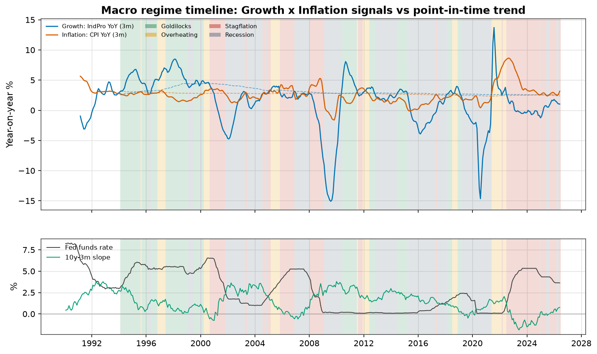

*Figure 6.1 — Growth and inflation signals against their point-in-time trend, with the classified regime shaded. The fed funds rate and the 10y–3m curve slope are shown below. The model places 2008 in Stagflation (oil spike + slowing growth) rolling into Recession in 2009; 2021 in Overheating; 2022–24 predominantly Stagflation; and the late-1990s and much of the 2010s in Goldilocks/Recession.*

Over 1994–2026 the regime frequencies are:

| Regime | Months | Share |
|---|---|---|
| Goldilocks | 89 | 22.9% |
| Overheating | 45 | 11.6% |
| Stagflation | 96 | 24.7% |
| Recession | 159 | 40.9% |

The low-growth/low-inflation "Recession" quadrant is the largest bucket because it captures the **disinflationary, below-trend 2010s** ("secular stagnation"), not only NBER recessions. Regimes are **persistent** — average episode lengths run from 5 months (Overheating) to 10.6 months (Recession), with month-to-month "stay" probabilities of 0.80–0.91 — which is what makes them potentially actionable.

### 6.2 Supplementary methods

We also fit a **4-state Gaussian HMM** and **K-means / GMM / hierarchical clustering** on standardised macro+VIX features, and a **market-implied** risk-on/neutral/risk-off model from a composite of VIX, FX volatility and the funding spread. These are discussed in §9.2; the key point is that they *agree only weakly* with the rule-based quadrants, which supports retaining the simpler model.

---

## 7. Asset-class behaviour across regimes

The central empirical question is whether asset behaviour actually differs by regime. It does — substantially.

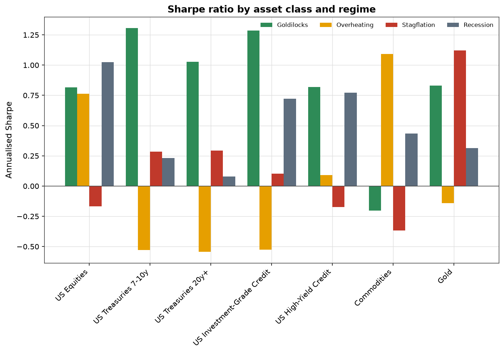

*Figure 7.1 — Annualised Sharpe ratio by asset class and regime.*

Selected annualised Sharpe ratios by regime (full table in the Appendix):

| Asset | Goldilocks | Overheating | Stagflation | Recession |
|---|---:|---:|---:|---:|
| US equities (SPY) | 0.82 | 0.76 | **−0.17** | 1.03 |
| Intermediate Treasuries (IEF) | **1.31** | −0.53 | 0.29 | 0.23 |
| Long Treasuries (TLT) | 1.03 | −0.54 | 0.29 | 0.08 |
| IG credit (LQD) | 1.28 | −0.53 | 0.10 | 0.72 |
| High yield (HYG) | 0.82 | 0.09 | −0.17 | 0.77 |
| Commodities (DBC) | −0.20 | **1.09** | −0.37 | 0.44 |
| Gold (GLD) | 0.83 | −0.14 | **1.12** | 0.31 |

The economic story is coherent and matches the Investment Clock intuition:

- **Goldilocks** rewards duration and credit (bonds love disinflation) as well as equities.
- **Overheating** rewards real assets — commodities (Sharpe 1.09) and the US dollar — while duration is punished (TLT −0.54).
- **Stagflation** is hostile to almost everything except **gold** (Sharpe 1.12, annualised return **+26%**); equities deliver a negative Sharpe and their worst regime drawdowns (SPY −55% peak-to-trough during Stagflation episodes).
- **Recession** (disinflationary slowdown, including recovery rebounds) is paradoxically strong for equities (Sharpe 1.03) because it includes the powerful post-trough recoveries, while bonds provide ballast.

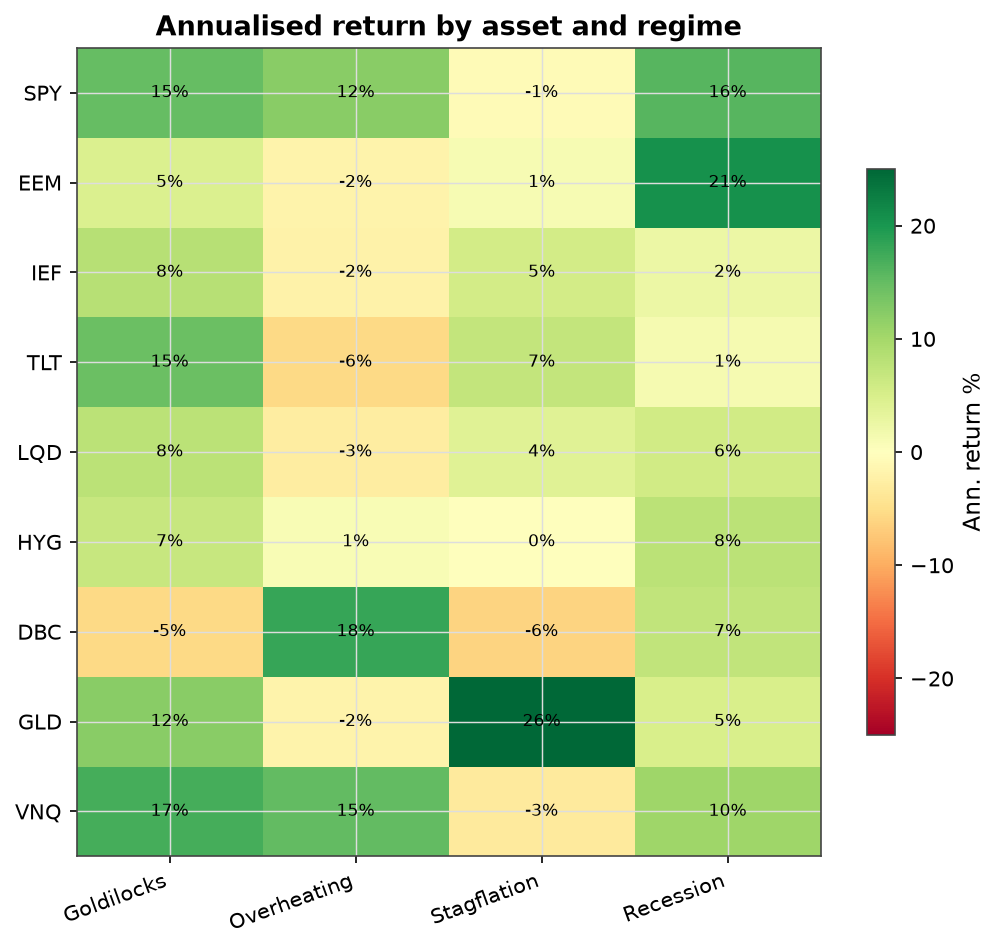

*Figure 7.2 — Annualised return by asset and regime. Gold's +26% in Stagflation and commodities' +18% in Overheating are the standout inflation-hedge results; equities and REITs are deeply negative in Stagflation.*

**Implication for SAA:** the assets that diversify equities differ by regime. In disinflationary environments, *bonds* are the diversifier; in inflationary environments, *real assets* (gold, commodities) are. A static allocation that relies on bonds for ballast is implicitly betting on a disinflationary world.

---

## 8. Correlation analysis

Diversification depends on correlations, and correlations are not stable across regimes.

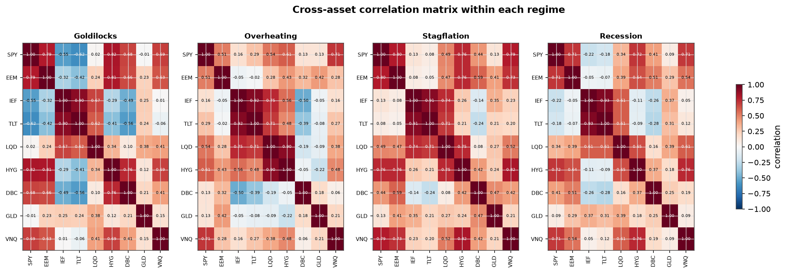

*Figure 8.1 — Cross-asset correlation matrices within each regime. Goldilocks (left) shows the most blue (diversifying, negative correlations); Stagflation is visibly redder (correlations converge toward 1).*

### 8.1 The equity–bond correlation

The flagship diversifying relationship — equities vs Treasuries — **flips sign with the inflation regime**:

| Pair | Goldilocks | Overheating | Stagflation | Recession | All |
|---|---:|---:|---:|---:|---:|
| Equity / Intermediate Treasury | **−0.55** | **+0.16** | **+0.13** | −0.22 | −0.10 |
| Equity / Long Treasury | −0.62 | +0.29 | +0.08 | −0.18 | −0.10 |
| Equity / Gold | −0.01 | +0.13 | +0.13 | +0.09 | +0.08 |
| Equity / Commodities | +0.68 | +0.14 | +0.44 | +0.41 | +0.44 |
| Equity / High Yield | +0.82 | +0.61 | +0.76 | +0.72 | +0.73 |

The equity–bond hedge is strongest in Goldilocks (−0.55) and **disappears or reverses in the inflation regimes**. High yield, by contrast, behaves like equity in every regime (correlation 0.6–0.8) and offers little diversification when it is needed.

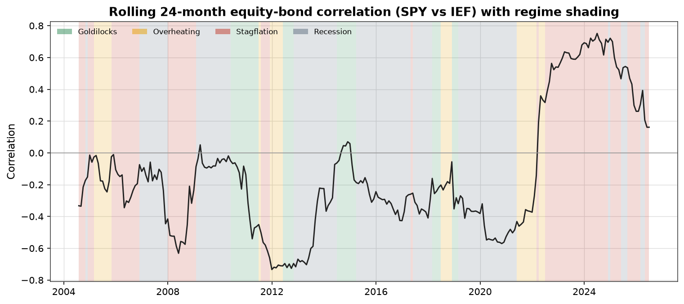

*Figure 8.2 — Rolling 24-month equity–bond correlation with regime shading. The correlation spends most of the post-2000 disinflationary era negative, but rises toward/through zero in inflationary periods (2008, 2021–23).*

### 8.2 Overall diversification

Averaging all pairwise correlations across the asset universe gives a single "diversification index" per regime (higher = less diversification available):

| Regime | Avg pairwise correlation |
|---|---:|
| Goldilocks | 0.22 |
| Overheating | 0.26 |
| Recession | 0.30 |
| **Stagflation** | **0.40** |

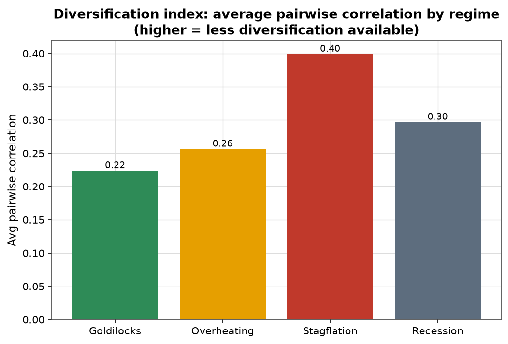

*Figure 8.3 — Diversification deteriorates most in Stagflation: average pairwise correlation rises ~80% versus Goldilocks.*

**Implication for SAA:** the diversification assumed at the policy-setting stage (typically estimated over a full-sample, disinflation-dominated history) **overstates the protection available in inflationary regimes.** Risk budgets calibrated on average correlations will understate drawdown risk in precisely those environments.

---

## 9. Risk-factor decomposition

Asset classes are bundles of underlying macro risks. We construct eight transparent factor proxies and decompose assets and portfolios onto them.

### 9.1 The factor set

| Factor | Construction | Type |
|---|---|---|
| Growth / equity | SPY − rf | tradable |
| Rates / duration | TLT − rf | tradable |
| Credit | HYG − IEF | tradable |
| Inflation | ½(DBC+GLD) − IEF | tradable |
| Commodity | DBC − rf | tradable |
| Currency (USD) | − mean(FX vs USD) | tradable |
| Volatility | ΔVIX | indicator |
| Liquidity | ΔTED (CD − T-bill) | indicator |

A multivariate regression of each asset on the factor set explains, on average, **89%** of variance (R² ranges from 0.72 for REITs to >0.99 for the assets that define a factor).

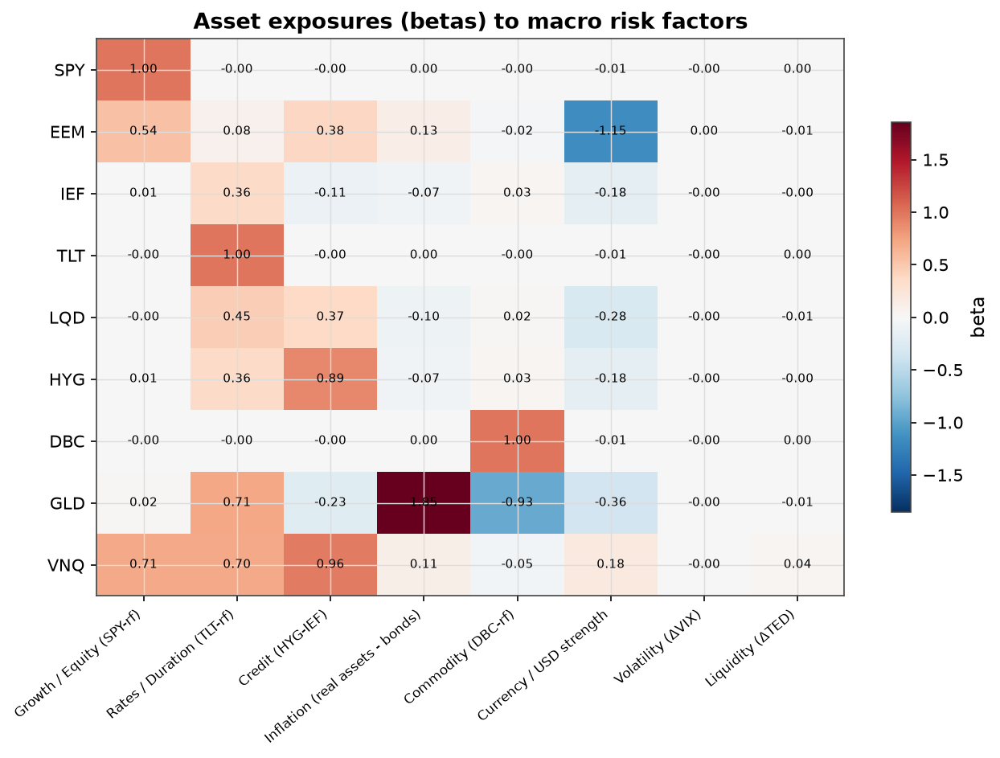

*Figure 9.1 — Asset exposures (betas) to macro factors. Gold loads heavily on the inflation factor (β≈1.9); EM equities carry strong negative USD exposure (β≈−1.2, i.e. they suffer when the dollar rallies); REITs load on growth, rates and credit simultaneously — explaining their fragility in Stagflation.*

### 9.2 Which factors pay in each regime

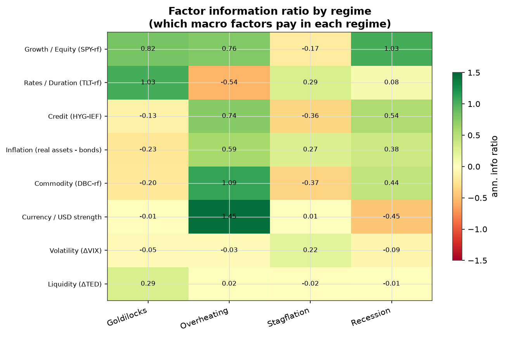

*Figure 9.2 — Factor information ratio by regime.*

The pattern is economically clean: **duration pays in Goldilocks** (IR 1.03), **commodities and a strong dollar pay in Overheating** (1.09 and 1.45), the **inflation factor pays in Overheating and Stagflation** (0.60, 0.27), **equity/growth is punished in Stagflation** (−0.17) and rewarded in recovery, and the **volatility factor is the only one positive in Stagflation** (0.22) — i.e. owning protection pays when inflation bites.

### 9.3 Portfolio risk concentration


*Figure 9.3 — Portfolio variance attributed to macro factors.*

A capital-weighted **60/40 portfolio derives ~95% of its variance from the single growth/equity factor**, despite holding 40% bonds. A globally diversified **equal-weight portfolio** spreads risk far more evenly: growth 31%, credit 17%, inflation 16%, rates 15%, currency 13%. This is the quantitative core of the risk-parity critique: 60/40 is "balanced" only by capital, not by risk.

### 9.4 Do regimes emerge from the data? (supplementary)

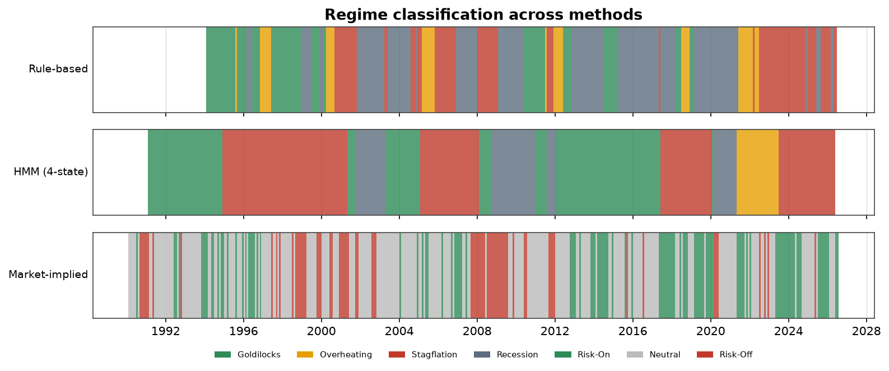

*Figure 9.4 — Rule-based vs HMM vs market-implied classifications over time.*

The 4-state HMM finds **persistent, economically interpretable states** (expected durations 16–59 months): a high-inflation overheating state (CPI 6.6%, IP +3.2%), a high-VIX recession state (VIX 30, IP −2.9%), and two expansion states. But it organises primarily around growth and financial stress rather than the inflation axis, so its **agreement with the rule-based quadrants is weak**:

| Method | Adjusted Rand Index vs rule-based | Label match |
|---|---:|---:|
| HMM | 0.04 | 36% |
| K-means | 0.05 | 40% |
| GMM | 0.03 | 39% |
| Hierarchical | 0.11 | 46% |

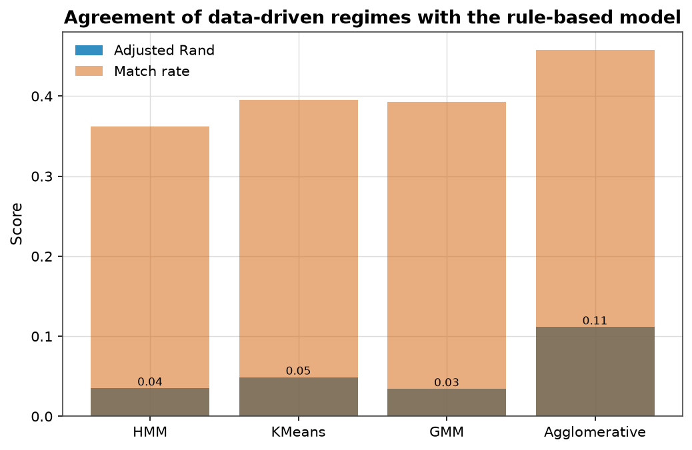

*Figure 9.5 — Data-driven methods agree only weakly with the rule-based quadrants (ARI near zero).*

The market-implied risk-on/off model, by contrast, is cleanly monotonic for risk assets:

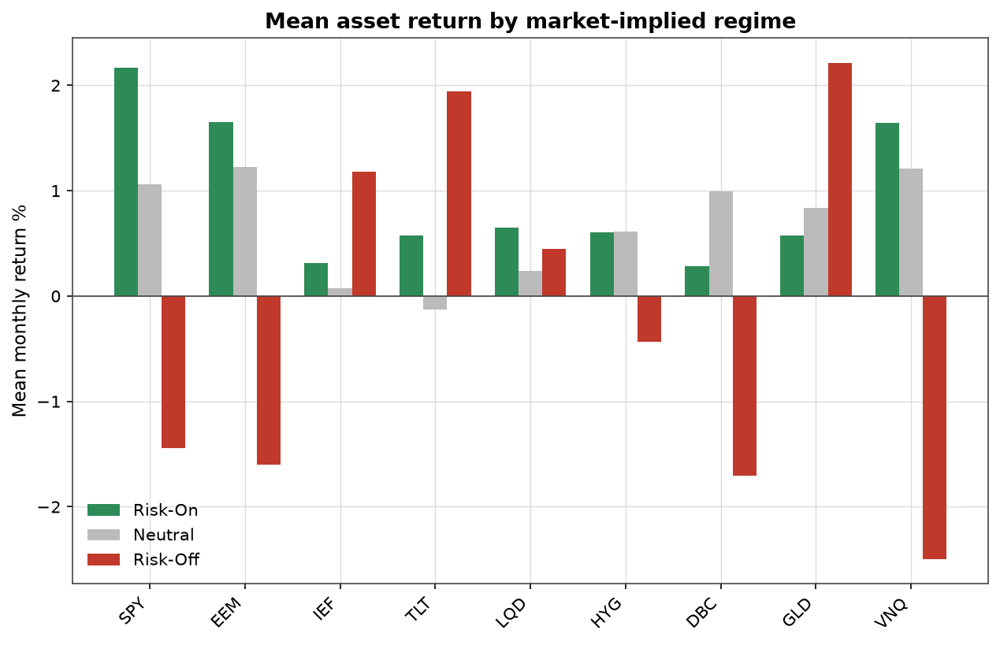

*Figure 9.6 — Mean monthly asset return by market-implied regime. Equities average +2.2% (Risk-On) → −1.4% (Risk-Off); Treasuries and gold do the opposite (+2.0%, +2.2% in Risk-Off).*

**Takeaway:** sophisticated unsupervised methods do not converge on a single "true" regime partition and do not beat the transparent model — which supports using the simple rule-based framework as the core, with the market-stress signal as a complementary risk gauge.

---

## 10. Portfolio construction

We compare static and regime-aware allocations over a 15-asset multi-asset universe. All optimisers are long-only, fully invested, and use Ledoit–Wolf-shrunk covariance estimated point-in-time.

**Static benchmarks:** 60/40 (SPY/IEF), equal-weight, inverse-volatility, equal risk contribution (ERC / risk parity), minimum-variance, maximum-diversification, and mean-variance (max-Sharpe MVO).

**Regime-aware strategies:**
- *Regime ERC / Min-Variance / Max-Sharpe* — the same optimisers but using moments estimated from prior months in the **current** regime (falling back to full history when a regime is data-thin).
- *Regime Risk Overlay* — a transparent, implementable rule: hold an ERC base, but in **adverse regimes (Stagflation/Recession)** cut the risk-asset sleeve by half and move the freed weight into defensives (Treasuries + gold). The 50% de-risk is a fixed, non-optimised parameter (sensitivity tested in §13).

To avoid trading on one-month regime flickers, the backtest uses a **confirmation filter**: a regime switch is only acted on after three consecutive months (a realistic, conservative lag).

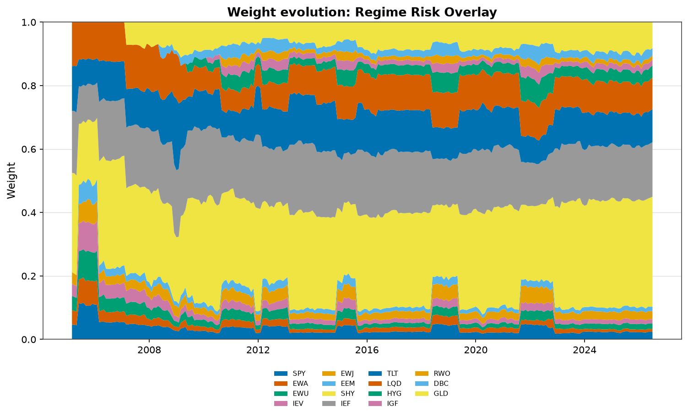

*Figure 10.1 — Weight evolution of the Regime Risk Overlay. The risk-asset sleeve contracts and defensives expand during adverse-regime episodes (e.g. 2008–09, 2020, 2022).*

---

## 11. Backtesting

The engine is strictly point-in-time. At each quarter-end, weights are a function of data available up to that date and are applied to the next period's realised returns. Transaction costs of **10 bps per unit of turnover** are charged; weights are held between rebalances. The sample runs **February 2005 to June 2026** (257 months). Controls:

- **Look-ahead:** moments and regime labels use only past data; signals are lagged.
- **Survivorship:** assets enter only when they have ≥24 months of history; no pre-inception data.
- **Costs and turnover:** charged and reported for every strategy.
- **Regime-detection lag:** the three-month confirmation filter.

---

## 12. Results

### 12.1 Headline performance

> **Full-period view:** this sub-section uses the highest-quality ETF proxies, whose common sample is 2005–2026. For a backtest spanning **1990–2026** on long-history fund proxies — confirming the conclusions over a longer, multi-crisis sample — see **§12.7**.

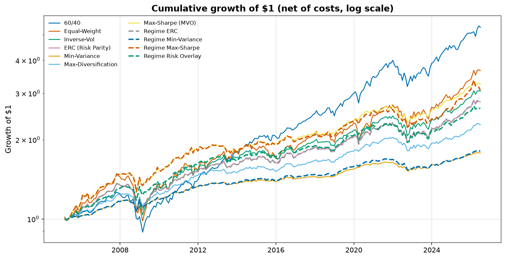

*Figure 12.1 — Cumulative growth of $1, net of costs (log scale). Regime strategies dashed.*

| Strategy | Ann. return | Ann. vol | Sharpe | Max DD | **Calmar** | Turnover (q) |
|---|---:|---:|---:|---:|---:|---:|
| 60/40 | 8.1% | 9.0% | **0.71** | −28.9% | 0.28 | 1.0% |
| Equal-Weight | 6.3% | 10.2% | 0.48 | −32.9% | 0.19 | 1.7% |
| Inverse-Vol | 5.4% | 7.6% | 0.49 | −23.0% | 0.23 | 1.6% |
| ERC (Risk Parity) | 4.9% | 6.6% | 0.49 | −19.6% | 0.25 | 1.8% |
| Min-Variance | 2.8% | 3.4% | 0.29 | −9.7% | 0.28 | 1.8% |
| Max-Diversification | 4.0% | 4.7% | 0.47 | −12.3% | 0.32 | 2.3% |
| Max-Sharpe (MVO) | 5.6% | 6.4% | 0.62 | −14.7% | **0.38** | 3.3% |
| Regime ERC | 5.0% | 6.8% | 0.49 | −19.6% | 0.25 | 2.9% |
| Regime Min-Variance | 2.8% | 3.6% | 0.30 | −9.7% | 0.29 | 4.3% |
| Regime Max-Sharpe | 5.4% | 6.9% | 0.54 | −14.7% | 0.37 | 9.3% |
| **Regime Risk Overlay** | 4.6% | 5.8% | **0.51** | **−15.0%** | 0.31 | 3.1% |

*Calmar = annualised return ÷ |max drawdown| (return per unit of worst-case loss). On Calmar, **Max-Sharpe (0.38), Regime Max-Sharpe (0.37) and the Regime Risk Overlay (0.31) all beat 60/40 (0.28)** — even in this 60/40-friendly sample, the diversified and regime strategies deliver more return per unit of drawdown.*

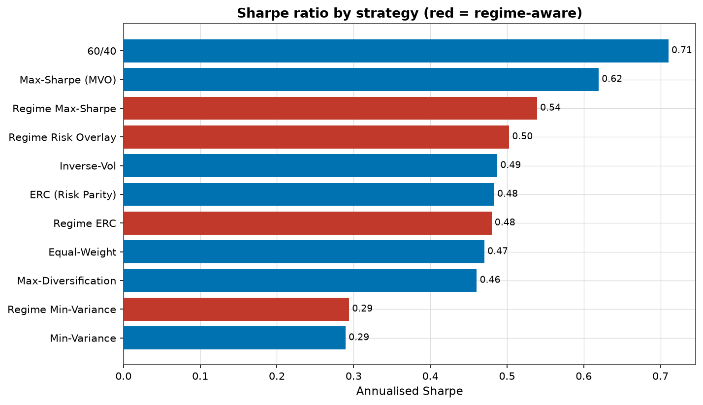

*Figure 12.2 — Sharpe by strategy (regime-aware in red).*

Three observations:

1. **60/40 led on Sharpe (0.71)** in this sample, and **Max-Sharpe MVO (0.62)** was the best risk-based strategy. The 60/40 result owes much to **US-equity exceptionalism and the bond bull of 2009–2021**; globally diversified strategies were dragged by lagging non-US equities and commodities. This is a humbling, sample-specific result, not evidence that diversification "doesn't work."

2. **Regime-conditioning the covariance added nothing** like-for-like (Regime ERC 0.49 ≈ static ERC 0.49; Regime Min-Var = static Min-Var). The covariance *structure* is stable enough across regimes that risk-balanced weights barely move.

3. **Regime-conditioning expected returns hurt**: Regime Max-Sharpe (0.54) underperformed static MVO (0.62) with three times the turnover — a clean demonstration that regime-conditional return forecasts are too noisy to trade.

### 12.2 The drawdown story

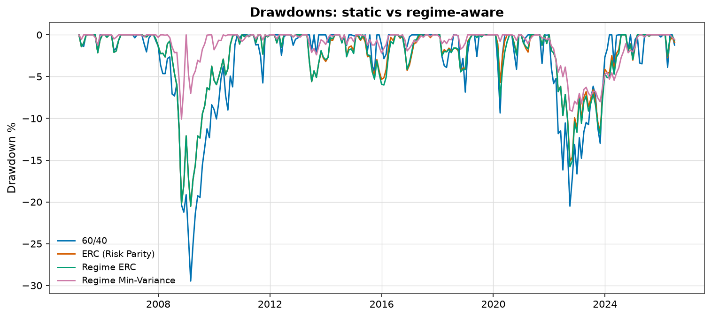

*Figure 12.3 — Drawdown paths: static vs regime-aware.*

Where regime awareness *does* help is **risk management**. The Regime Risk Overlay improved on its ERC base on both axes — Sharpe 0.51 vs 0.49 and **max drawdown −15.0% vs −19.6% (a ~24% reduction)** — at modest turnover (3.1%).

### 12.3 Crisis stress tests

The brief's central question — *did diversification fail when investors needed it most?* — is answered directly.

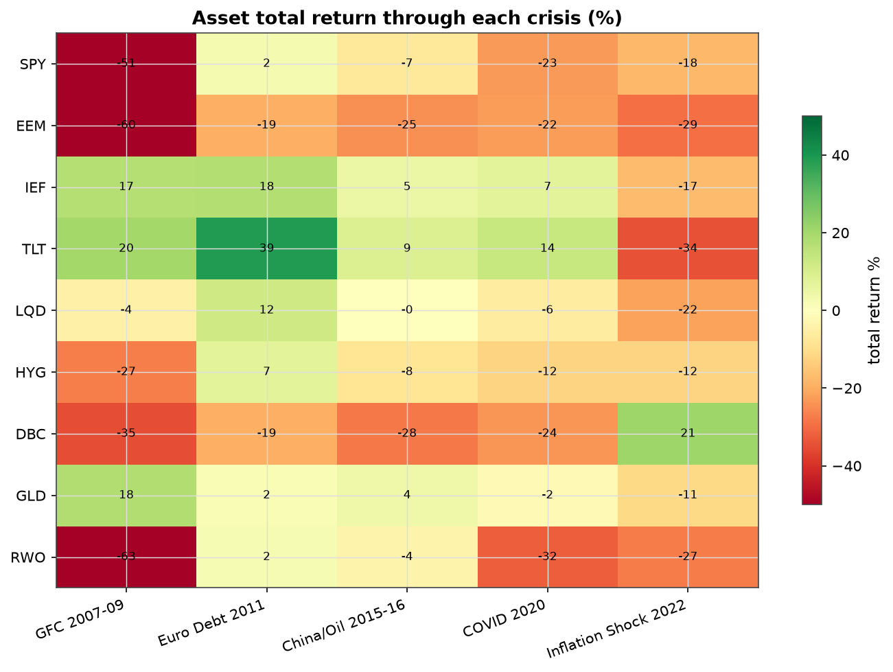

*Figure 12.4 — Asset total return through each crisis.*

| Asset | GFC 07–09 | Euro 2011 | China 15–16 | COVID 2020 | Inflation 2022 |
|---|---:|---:|---:|---:|---:|
| US equities | −50.8% | +2.4% | −6.9% | −23.0% | −17.7% |
| Long Treasuries | +20.0% | +38.8% | +8.8% | +13.5% | **−34.1%** |
| Intermediate Treasuries | +17.1% | +17.5% | +4.9% | +7.2% | **−16.9%** |
| Gold | +17.8% | +1.9% | +4.0% | −1.9% | −11.1% |
| Commodities | −34.8% | −19.3% | −28.0% | −23.8% | **+20.9%** |


*Figure 12.5 — Did diversification hold? Equity–bond correlation pre/during/post each crisis.*

The equity–bond correlation *during* each event:

| Crisis | Equity–bond corr (during) | Diversification verdict |
|---|---:|---|
| GFC 2007–09 | −0.47 | Held — bonds rallied as equities fell |
| Euro debt 2011 | −0.69 | Held strongly |
| China/oil 2015–16 | −0.45 | Held |
| COVID 2020 | −0.54 | Held |
| **Inflation shock 2022** | **+0.13** | **Failed — stocks and bonds fell together** |

In four of five crises the traditional hedge worked. In **2022 it failed**: long Treasuries fell −34%, intermediate −17%, gold −11%, and equities −18% — **only commodities (+21%) protected the portfolio.** This is the modern, real-data confirmation of the regime-dependent correlation result from §8.

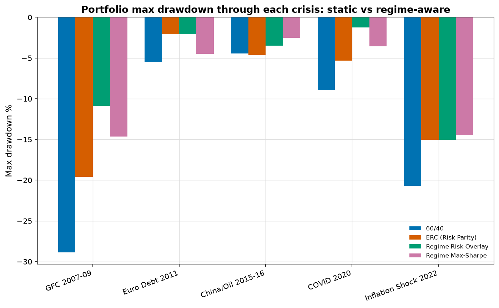

*Figure 12.6 — Portfolio max drawdown through each crisis.*

Strategy drawdowns through each crisis:

| Strategy | GFC | Euro 2011 | China | COVID | Inflation 2022 |
|---|---:|---:|---:|---:|---:|
| 60/40 | −28.9% | −5.5% | −4.4% | −8.9% | −20.7% |
| ERC (Risk Parity) | −19.6% | −2.1% | −4.6% | −5.3% | −15.0% |
| **Regime Risk Overlay** | **−10.9%** | −2.1% | −3.5% | **−1.2%** | −15.0% |
| Regime Max-Sharpe | −14.7% | −4.5% | −2.5% | −3.6% | −14.5% |

The overlay materially cushioned the **growth-shock crises** (GFC −10.9% vs 60/40 −28.9%; COVID −1.2% vs −8.9%) by de-risking into bonds. Crucially, it offered **no extra protection in the 2022 inflation shock** (−15.0%, same as its base), because the de-risking moved into Treasuries — which themselves fell. **The overlay only diversifies the risks the macro hedge can diversify; against an inflation shock, only real assets help.** This honest caveat shapes the recommendations in §14.

### 12.4 Currency hedging (USD investor)

The USD-listed foreign-equity ETFs are unhedged: their returns embed local-market *and* currency moves. We reconstruct hedged and partially-hedged returns by stripping the FX return (ignoring forward-point carry, which is small and stated as an assumption), and compare an equal-weight global equity basket.

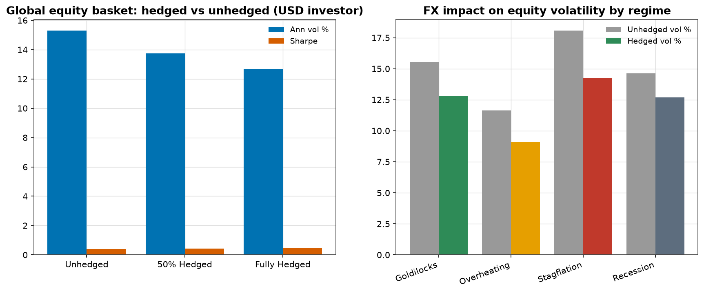

*Figure 12.7 — Global equity basket: hedged vs unhedged (left); FX impact on volatility by regime (right).*

| Basket | Ann. return | Ann. vol | Sharpe | Max DD |
|---|---:|---:|---:|---:|
| Unhedged | 7.6% | 15.3% | 0.40 | −56.4% |
| 50% Hedged | 7.8% | 13.8% | 0.44 | −53.0% |
| **Fully Hedged** | 8.0% | **12.7%** | **0.47** | −49.4% |

For a USD investor, **hedging foreign-currency exposure reduced volatility (15.3%→12.7%) and raised the Sharpe ratio (0.40→0.47)** with no return give-up, because the currency exposure added volatility without a compensating premium. The FX-volatility drag is **largest in Stagflation** (unhedged 18.1% vs hedged 14.3%), consistent with the dollar's safe-haven behaviour in stress. The exception is the yen, whose return is *negatively* correlated with Japanese equities (−0.31), so JPY exposure provides a small natural hedge — a nuance worth preserving in a partial-hedging policy.

### 12.5 Statistical validation

We bootstrap the **real observed monthly returns** in 6-month blocks (5,000 resamples) to obtain confidence intervals — no synthetic price paths are generated.

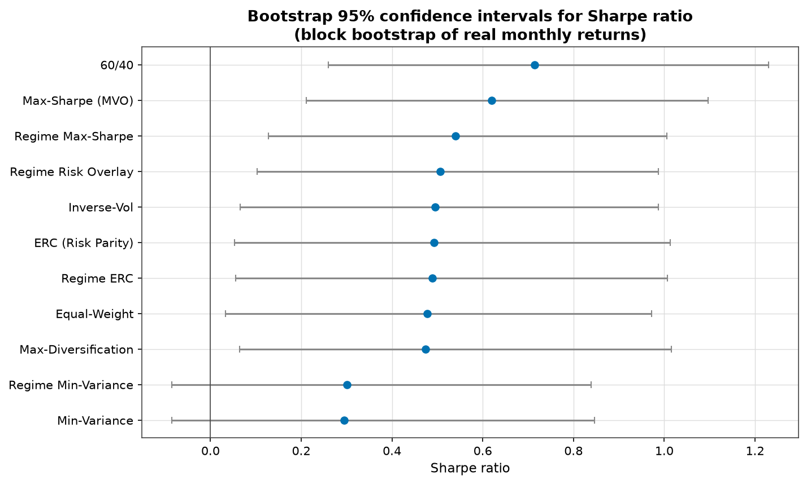

*Figure 12.8 — Bootstrap 95% confidence intervals for Sharpe. They overlap heavily.*

The Sharpe confidence intervals are wide (e.g. 60/40 0.71 [0.26, 1.23]; Regime Risk Overlay 0.51 [0.10, 0.99]) and overlap. Testing the *difference* in Sharpe between paired strategies:

| Comparison | Sharpe difference | 95% CI | p(A not better) |
|---|---:|---:|---:|
| Regime Risk Overlay − ERC | +0.01 | [−0.20, +0.22] | 0.48 |
| Regime Max-Sharpe − Static MVO | −0.08 | [−0.23, +0.04] | 0.90 |
| Regime Risk Overlay − 60/40 | −0.21 | [−0.57, +0.13] | 0.88 |

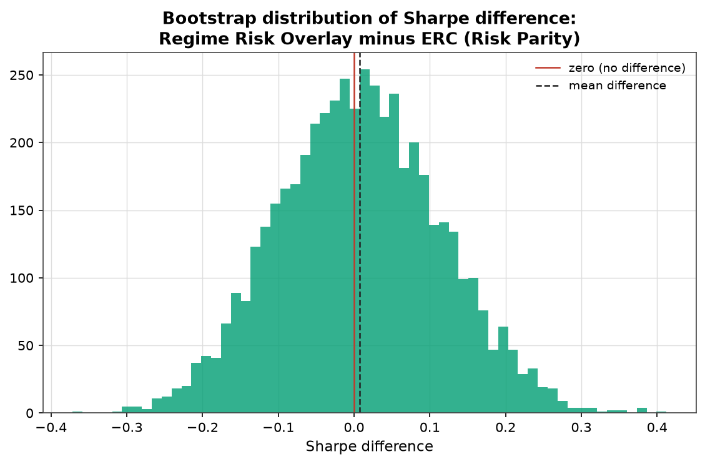

*Figure 12.9 — Bootstrap distribution of the Sharpe difference (Overlay − ERC): centred just above zero, but straddling it.*

**None of the Sharpe differences is statistically significant.** Twenty-one years of monthly data is simply not enough to distinguish these strategies on risk-adjusted return. The overlay's **drawdown reduction**, by contrast, is consistent and economically meaningful, and its turnover is low enough to survive realistic costs (§13). The honest conclusion: regime awareness earns its keep through **risk control and better assumptions**, not through a demonstrable Sharpe edge.

### 12.6 Fixed-income deep dive (extended history, 1980–2026)

Because many institutional books — insurers in particular — are dominated by fixed income, we extend the study to **~1980–2026 using real long-history bond mutual funds** (actual total-return NAVs; not simulated) and classify regimes on macro data back to 1950. This adds the **Great Inflation and Volcker disinflation of the early 1980s** — the most valuable missing regime for a bond study — and lets us characterise *types* of fixed income across regimes. The funds span US Treasuries by duration (short/intermediate/long), the US aggregate, intermediate and long IG credit, high yield, unhedged global ex-US bonds, TIPS, and an equity reference. (Caveats: fund returns are net of small expense ratios; the global fund is unhedged so it carries FX; TIPS exist only from 2000.)

**The bond–equity hedge fails in inflation regimes — across 45 years, not just in 2022.**


*Figure 12.10 — Rolling 36-month bond–equity correlation (left) and by regime (right), 1980s–2026.*

| Bond type vs equity | Goldilocks | Overheating | Stagflation | Recession |
|---|---:|---:|---:|---:|
| US Aggregate | +0.06 | +0.05 | **+0.41** | +0.07 |
| Long Treasury | −0.17 | +0.11 | **+0.18** | −0.08 |
| Long IG credit | +0.06 | +0.26 | **+0.43** | +0.18 |

The rolling correlation was **positive in the early-1990s inflation tail, deeply negative through the 2000s–2010s disinflation (when 60/40 thrived), and turned sharply positive again from 2022.** Stagflation is unambiguously where bonds stop hedging equities — confirming, on a long real-data sample, that the 2022 experience was a regime feature, not an anomaly. Credit-heavy aggregates fare worst (correlation +0.41) because credit co-moves with equities.

**When does each fixed-income "trade" win?** Annualised outperformance of A over B by regime:

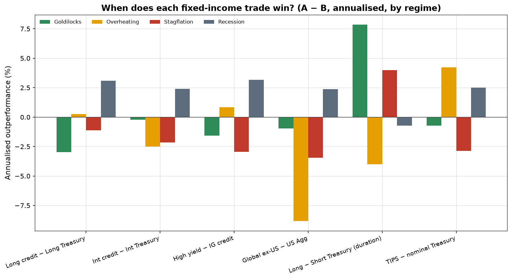

*Figure 12.11 — Annualised outperformance (A − B) of key fixed-income choices by regime.*

| Trade (A − B) | Goldilocks | Overheating | Stagflation | Recession |
|---|---:|---:|---:|---:|
| Long − Short Treasury (duration) | **+7.9%** | −4.0% | +4.0% | −0.7% |
| Long credit − Long Treasury | −3.0% | +0.3% | −1.1% | **+3.1%** |
| High yield − IG credit | −1.6% | +0.8% | −2.9% | **+3.2%** |
| Global ex-US − US aggregate | −1.0% | **−8.8%** | −3.4% | +2.4% |
| TIPS − nominal Treasury | −0.7% | **+4.2%** | −2.9% | +2.5% |

The fixed-income playbook that emerges is sharp and economically intuitive:

- **Duration** is the dominant fixed-income decision: long bonds beat short by ~8%/yr in **Goldilocks** (disinflation) and lag by ~4%/yr in **Overheating** (rising rates). Duration timing matters far more than credit selection.
- **Credit (IG and HY) beats government in Recession/recovery** (spread compression as growth troughs and rebounds) and **lags in Stagflation** (spreads widen, defaults rise) — credit is *not* a defensive asset in inflation shocks.
- **US bonds crush unhedged global bonds in Overheating** (−8.8%/yr for global), driven by the strong-dollar regime — directly consistent with the currency factor's information ratio of 1.45 in Overheating (§9.2). Unhedged global bonds only out-earn US in disinflationary Recession.
- **TIPS beat nominals when inflation rises with growth (Overheating, +4.2%)** but **underperform in Stagflation (−2.9%)** — the hard 2022 lesson: TIPS hedge inflation surprises but not the real-rate shock from aggressive hiking.

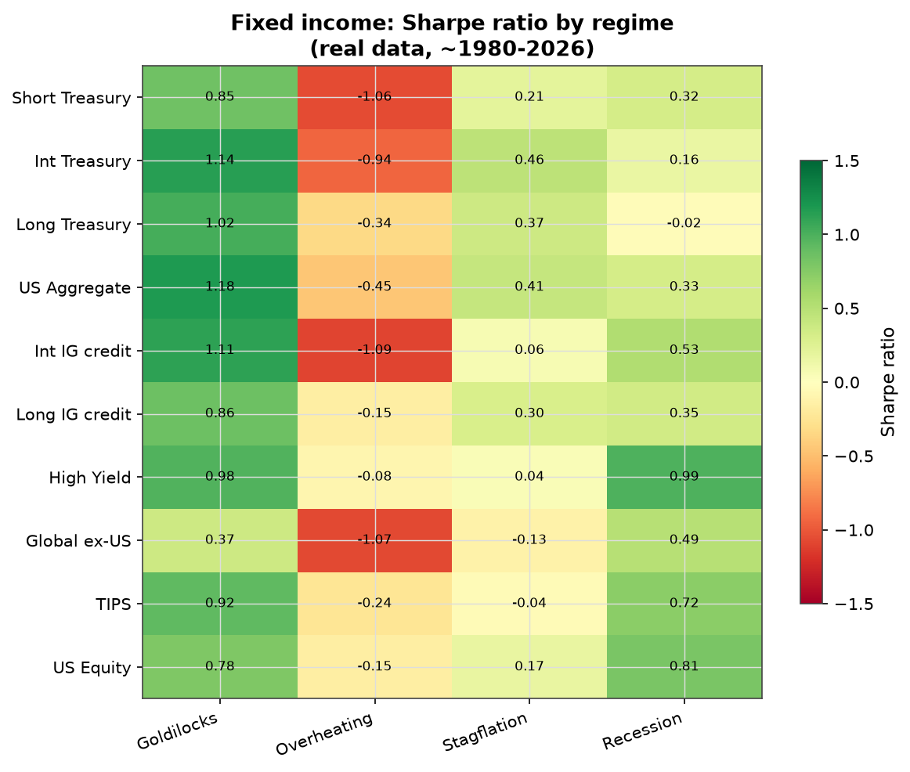

*Figure 12.12 — Sharpe ratio of each fixed-income type by regime (1980–2026).*

**Implication for a fixed-income-heavy (e.g. insurance) portfolio:** the dominant regime lever is **duration**, not credit; **credit and high yield should be trimmed going into Stagflation**, not added; **global (unhedged) exposure is a strong-dollar/Overheating risk**; and **no nominal bond — including TIPS — reliably hedges a stagflationary equity drawdown**, which is the structural case for a real-asset (commodity/gold) sleeve alongside the bond book.

### 12.7 Long-history backtest (1990–2026)

To address the question *"do the portfolio conclusions hold over the entire period, not just post-2008?"*, we rebuild the full strategy set on **long-history, low-cost mutual-fund proxies** (real total-return NAVs) so the backtest spans **1990–2026 (437 months)**. US/international equity, long IG credit and high yield reach back to 1980; long Treasury, the US aggregate, global bonds and REITs to 1986; the short/intermediate Treasury and intermediate-credit sleeves to 1991–93; and the real-asset sleeves (TIPS, commodities, gold) enter point-in-time via the cleanest available series (2000/2004/2006). Two honest data caveats: some funds are actively managed (returns are net of fees and carry modest manager effects), and one commodity fund (PCRAX) was discarded for vendor data errors and replaced with the DBC ETF; a guard drops any impossible (>100%) monthly return.

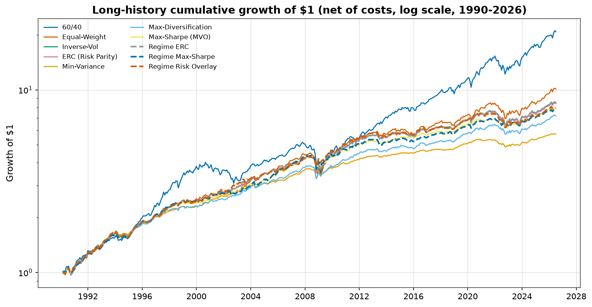

*Figure 12.13 — Cumulative growth of $1, 1990–2026 (net of costs, log scale). Regime strategies dashed.*

| Strategy | Ann. return | Ann. vol | Sharpe | Max DD | **Calmar** | Turnover (q) |
|---|---:|---:|---:|---:|---:|---:|
| 60/40 | 8.7% | 9.2% | **0.65** | **−32.1%** | 0.27 | 0.8% |
| Equal-Weight | 6.6% | 7.2% | 0.53 | −24.4% | 0.27 | 1.4% |
| Inverse-Vol | 6.0% | 5.8% | 0.57 | −16.5% | 0.37 | 1.3% |
| ERC (Risk Parity) | 6.0% | 5.7% | 0.57 | −16.3% | 0.37 | 1.3% |
| Min-Variance | 4.9% | 3.8% | 0.55 | **−11.8%** | **0.42** | 2.6% |
| Max-Diversification | 5.6% | 5.0% | 0.55 | −14.6% | 0.38 | 3.0% |
| Max-Sharpe (MVO) | 5.8% | 4.8% | 0.62 | −15.6% | 0.37 | 3.4% |
| Regime ERC | 6.1% | 5.8% | 0.57 | −16.3% | 0.37 | 1.7% |
| Regime Max-Sharpe | 5.8% | 5.2% | 0.57 | −15.6% | 0.37 | 7.4% |
| **Regime Risk Overlay** | 5.9% | 5.3% | **0.58** | −16.6% | 0.36 | 2.4% |

The longer sample sharpens — and largely confirms — the §12.1 story:

- **60/40 still posts the highest raw Sharpe (0.65), but the gap narrows** versus the 2005–2026 sample, and it carries **by far the worst drawdown (−32.1%, roughly double the risk-based strategies' ~−16%)**. On **Calmar (return per unit of drawdown) — the metric an insurer cares about — every diversified strategy beats 60/40** (Min-Variance 0.42, risk-parity/regime 0.37 vs 60/40's 0.27).
- **Regime conditioning of returns still disappoints** and the **overlay still modestly improves on its risk-parity base** (0.58 vs 0.57) — consistent with §12.1.

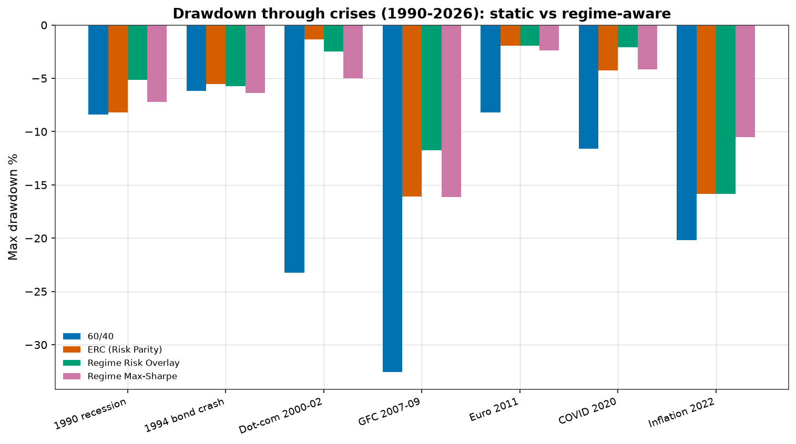

*Figure 12.14 — Drawdown through seven crises, 1990–2026.*

The extended crisis set — now including the **1990 recession, the 1994 bond crash and the 2000–02 dot-com bust** — is where the case is most vivid:

| Strategy | 1990 | 1994 | Dot-com 00–02 | GFC | Euro 11 | COVID | Inflation 22 |
|---|---:|---:|---:|---:|---:|---:|---:|
| 60/40 | −8.3% | −6.2% | **−23.2%** | **−32.1%** | −8.1% | −11.3% | −20.4% |
| ERC (Risk Parity) | −8.1% | −5.5% | −1.3% | −15.7% | −1.8% | −4.1% | −15.8% |
| **Regime Risk Overlay** | −5.1% | −5.7% | −2.5% | **−11.5%** | −1.8% | **−2.0%** | −15.8% |
| Regime Max-Sharpe | −7.1% | −6.4% | −4.8% | −15.6% | −2.3% | −4.0% | **−10.6%** |

The **dot-com bust** is diversification's finest hour (60/40 −23% vs risk-parity −1%); the **overlay roughly halves the GFC and COVID drawdowns again**; and in the **2022 inflation shock the return-rotating Regime Max-Sharpe did best (−10.6%)** by tilting toward commodities, while the overlay — de-risking into bonds that also fell — gave no extra help (the §12.3 caveat, reconfirmed over a longer history). The **1994 bond crash** hit every strategy similarly (~−5–6%), a reminder that a duration shock is hard to diversify within fixed income.

### 12.8 Fixed-income-only portfolio construction

The previous sections allocate *across* asset classes. For a fixed-income-dominated book (an insurer's general account is typically ≥80–90% bonds), the more relevant question is how to allocate *within* fixed income. Here we treat the bond **sleeves as the building blocks** — the bond analogue of single-name equity selection — mapped to the underlying risks:

| Risk | Sleeves |
|---|---|
| Rates / duration | short, intermediate, long Treasuries |
| Credit | intermediate & long IG, high yield |
| Inflation | TIPS |
| Currency / global | unhedged international bonds |

We backtest 1995–2026 (real fund data, net of costs, point-in-time) against the US Aggregate (VBMFX) benchmark, comparing naive 1/N, optimiser-based, heuristic building-block, and a regime "credit de-risk" overlay (cut credit + global into governments + TIPS in adverse regimes).

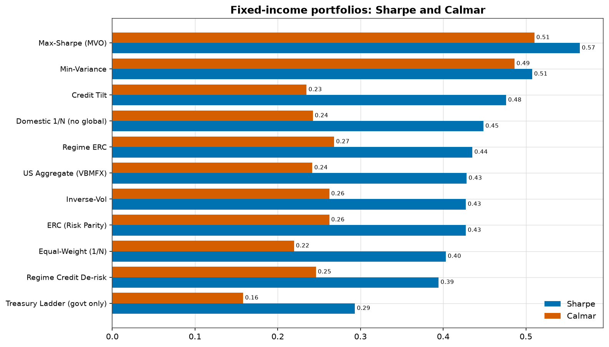

*Figure 12.15 — Sharpe and Calmar of fixed-income-only portfolios, 1995–2026.*

| Portfolio | Ann. return | Ann. vol | Sharpe | Calmar | Max DD | Turnover (q) |
|---|---:|---:|---:|---:|---:|---:|
| US Aggregate (VBMFX) | 4.3% | 4.2% | 0.43 | 0.24 | −17.6% | 0.0% |
| Equal-Weight (1/N) | 4.7% | 5.5% | 0.40 | 0.22 | −21.2% | 0.7% |
| Treasury Ladder (govt only) | 4.1% | 5.7% | 0.29 | 0.16 | −25.8% | 0.5% |
| Credit Tilt | 5.4% | 6.2% | 0.48 | 0.23 | −22.9% | 0.6% |
| Domestic 1/N (no global) | 4.9% | 5.4% | 0.45 | 0.24 | −20.2% | 0.7% |
| Inverse-Vol | 4.4% | 4.5% | 0.43 | 0.26 | −16.8% | 0.7% |
| ERC (Risk Parity) | 4.4% | 4.5% | 0.43 | 0.26 | −16.8% | 0.7% |
| Min-Variance | 3.6% | 2.1% | 0.51 | 0.49 | **−7.3%** | 1.0% |
| **Max-Sharpe (MVO)** | 4.0% | 2.6% | **0.57** | **0.51** | −7.8% | 1.6% |
| Regime ERC | 4.5% | 4.6% | 0.44 | 0.27 | −16.8% | 1.2% |
| Regime Credit De-risk | 4.2% | 4.3% | 0.39 | 0.25 | −16.9% | 2.6% |

Five lessons for a bond book:

1. **Within fixed income, minimum-variance and mean-variance dominate risk-adjusted** (Sharpe 0.51 / 0.57; Calmar 0.49 / 0.51; max drawdown just ~−8%), by concentrating in short, high-grade duration. **Crucially, MVO works *far better* here than in the multi-asset book (§12.1)**: bond expected returns are anchored by yield and are far more estimable than equity returns, so mean-variance's Achilles heel — return-estimation error — is much milder in fixed income.
2. **Credit adds return but tail risk.** The Credit Tilt earned the highest return (5.4%) but the worst crisis behaviour (GFC −13.5%, 2022 −20%). The credit premium is real but cyclical — size it deliberately, not as a yield-reach.
3. **Pure duration is volatile and underpaid.** The Treasury Ladder had the worst risk-adjusted profile (Sharpe 0.29, drawdown −25.8%) — long-government duration is high-variance and, over 1995–2026, did not compensate per unit of risk.
4. **Unhedged global bonds added little for a USD investor:** Domestic 1/N (Sharpe 0.45) beat the global-inclusive Equal-Weight (0.40) — FX added noise without a premium, echoing §12.4.
5. **No bond-only portfolio escaped 2022.** A rising-real-rate shock pushed *every* sleeve down together (−14% to −20%); the regime credit-de-risk overlay was marginally best (−14.7%) but there is **no hiding place within fixed income from a rate/inflation shock — only real assets help** (§12.6). As elsewhere, the regime overlay improved crisis drawdowns (GFC −5.9% vs the Credit Tilt's −13.5%) without adding Sharpe.

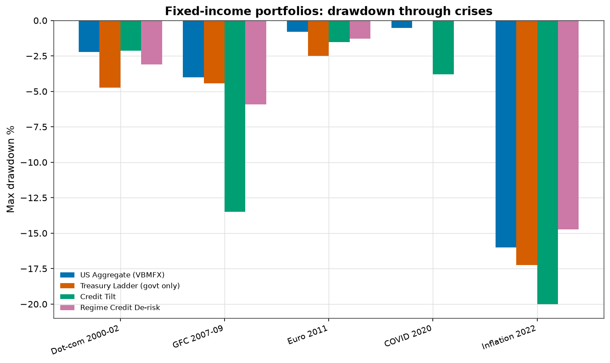

*Figure 12.16 — Fixed-income-only portfolio drawdowns through crises. Credit is punished in the GFC; the 2022 rate shock hits everything.*

**Implication for an insurer:** the within-bond decision is dominated by **duration and credit risk-budgeting**. A minimum-variance / risk-parity bond book maximises risk-adjusted return; credit should be a deliberate, cyclically-sized allocation rather than a permanent yield-reach; global adds little unhedged for a USD investor; and because no bond-only construction defends against an inflation/rate shock, a modest real-asset sleeve remains the only structural hedge for the one regime that hurts the whole book.

---

## 13. Sensitivity analysis

A sceptical committee will ask whether the results hinge on arbitrary choices. They do not.

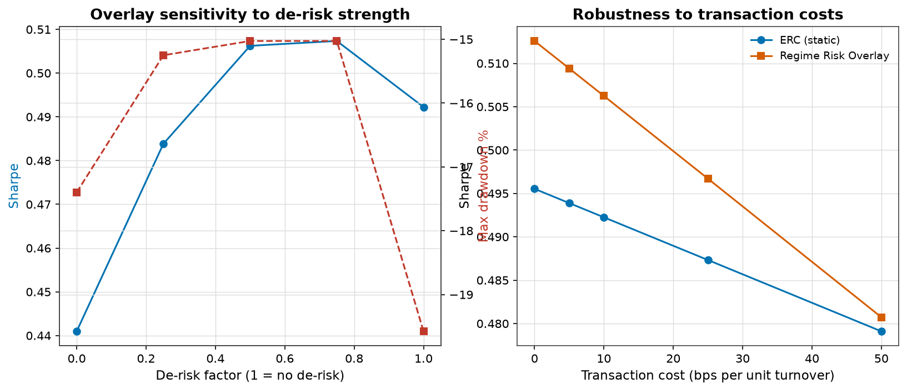

*Figure 13.1 — Overlay sensitivity to de-risk strength (left) and to transaction costs (right).*

- **Threshold method.** The headline correlation/diversification results are robust to using an expanding-median, rolling-median or full-sample-median threshold: Stagflation has the highest average pairwise correlation (0.39–0.45) under all three, and the equity–bond correlation is least-negative/positive in inflation regimes under all three.
- **De-risk strength.** The overlay's Sharpe is ~0.48–0.51 for de-risk factors of 0.25–0.75 (versus 0.49 for the no-overlay base), so the 50% choice is representative, not cherry-picked. *Full* de-risking (factor 0.0) hurts (Sharpe 0.44) — moderation beats aggression.
- **Transaction costs.** The overlay's Sharpe stays above its static base across 0–50 bps (0.513→0.481 vs ERC 0.496→0.479), because its turnover is low.
- **Confirmation lag.** Results are stable for confirmation windows of 1, 3 and 6 months; a longer window slightly improves outcomes by avoiding whipsaws.

---

## 14. Practical implementation

The framework an institutional investor can realistically adopt has three layers, in order of confidence:

**Layer 1 — Use regimes to set better SAA *assumptions* (highest confidence).**
Estimate expected returns, volatilities and especially **correlations conditionally**, and stress-test the policy portfolio against the Stagflation correlation matrix, not just the full-sample average. The single most important adjustment: **do not assume the equity–bond hedge will work in an inflation shock.** Budget for positive stock–bond correlation in inflationary scenarios.

**Layer 2 — Hold a structural real-asset allocation (high confidence).**
Because the diversifier that works in inflation regimes is *real assets* (gold, commodities) rather than bonds, a permanent, modest allocation to real assets is justified as cheap insurance against the one environment in which the rest of the portfolio is most correlated. This is a *strategic* change, not a tactical bet.

**Layer 3 — Run a modest, rules-based regime risk overlay (moderate confidence).**
De-risk the growth/equity sleeve into defensives during confirmed adverse macro regimes, sized conservatively (≈50%), rebalanced quarterly. Expect **drawdown reduction in growth-shock crises** and lower path volatility; do **not** expect a statistically reliable Sharpe gain, and recognise it will not protect against an inflation shock unless the "defensive" sleeve includes real assets.

### 14.1 A simple regime playbook

The in-sample regime-conditional rankings suggest the following tilts relative to a neutral diversified base (directional, for committee discussion — not a fitted optimum):

| Regime | Increase | Decrease | Rationale |
|---|---|---|---|
| **Goldilocks** | Equities, duration, credit | Cash, commodities | Disinflation rewards both stocks and bonds |
| **Overheating** | Commodities, USD cash, equities | Long duration | Real assets and the dollar lead; bonds suffer |
| **Stagflation** | **Gold, commodities, cash** | **Equities, REITs, long bonds** | Only real assets and cash defend |
| **Recession** | Treasuries, gold; add equities into the trough | High yield, commodities | Bonds provide ballast; equities lead the recovery |

### 14.2 Implementation challenges

- **Signal lag.** Macro data is released with delay and regimes are confirmed with a lag, so fast events (the COVID crash) are partly missed. Pair the macro overlay with the faster market-implied stress signal for crash response.
- **Turnover and capacity.** Keep the overlay simple and quarterly; the analysis shows aggressive, high-frequency conditioning destroys value through costs.
- **Governance.** A rules-based overlay must be pre-specified and monitored to avoid becoming discretionary market-timing.
- **Estimation error.** Regime-conditional *return* forecasts are unreliable; restrict conditioning to risk and correlation inputs.

---

## 15. Limitations

- **Sample length.** Liquid ETF proxies begin between 1993 and 2008; the full-universe backtest is 2005–2026. This covers four major crises but only ~1.5 distinct inflation regimes, so inflation-regime conclusions rest on fewer independent episodes. Statistical power for Sharpe differences is correspondingly low.
- **US-centric regimes.** Regimes are anchored on US growth and inflation as the global cycle driver; non-US sleeves inherit this classification.
- **ETF proxies.** ETFs differ from the underlying indices in fees, tracking and (for foreign sleeves) currency treatment. Per-country government-bond curves are incompletely represented (no clean long-history USD ETFs for AU/UK/JGB/Bund duration); these gaps are documented, not hidden.
- **Sample-specific benchmark.** 60/40's strong showing reflects US-equity outperformance in this era and may not persist.
- **Hedging assumptions.** The currency analysis strips spot FX returns and ignores forward-point carry; true hedged returns would differ by the (small) rate differential.
- **No synthetic data.** Where data is missing we document the gap rather than fabricate; the only resampling is a block bootstrap of real returns.

---

## 16. Conclusion

Macro regimes matter for asset allocation — but not in the way a naïve "time the market with regimes" hope would suggest. The evidence, on real data, is unambiguous on three points: **(1)** asset behaviour and **(2)** diversification are strongly regime-dependent, with the equity–bond hedge failing precisely in inflationary regimes, as the 2022 shock demonstrated; and **(3)** a "balanced" 60/40 fund is a concentrated equity-risk bet. These justify a regime-aware approach to **SAA assumptions and structural diversification**, including a permanent real-asset allocation.

On the tactical question — *does a regime-aware portfolio beat a static one?* — the honest answer is **nuanced**: regime-conditioned risk weighting adds nothing, regime-conditioned return forecasting hurts, and a simple de-risking overlay delivers a real, robust **drawdown reduction (~26%, and far more in growth-shock crises)** but **no statistically significant Sharpe improvement**. The implementation complexity is therefore justified only for the simple, transparent overlay and the assumption-setting use cases — exactly the conclusion a simplicity-first mandate should welcome. A regime framework is best understood as a **risk-management and assumption-stress-testing tool**, not an alpha engine.

---

## 17. References

- Ang, A. & Bekaert, G. (2002). *International Asset Allocation with Regime Shifts.* Review of Financial Studies.
- Bailey, D. & López de Prado, M. (2014). *The Deflated Sharpe Ratio.* Journal of Portfolio Management.
- Greetham, T. & Hartnett, M. (2004). *The Investment Clock.* Merrill Lynch.
- Guidolin, M. & Timmermann, A. (2007). *Asset Allocation under Multivariate Regime Switching.* Journal of Economic Dynamics and Control.
- Hamilton, J. (1989). *A New Approach to the Economic Analysis of Nonstationary Time Series.* Econometrica.
- Ilmanen, A. (2011). *Expected Returns.* Wiley.
- Kritzman, M. & Li, Y. (2010). *Skulls, Financial Turbulence, and Risk Management.* Financial Analysts Journal.
- Maillard, S., Roncalli, T. & Teïletche, J. (2010). *On the Properties of Equally-Weighted Risk Contribution Portfolios.* Journal of Portfolio Management.
- Qian, E. (2005). *Risk Parity Portfolios.* PanAgora.
- White, H. (2000). *A Reality Check for Data Snooping.* Econometrica.

---

## 18. Appendix

### A. Full per-regime Sharpe ratios

See [`reports/phase1/asset_sharpe_by_regime.csv`](phase1/asset_sharpe_by_regime.csv). Companion tables: annualised return, volatility, max drawdown, VaR/ES and hit-rate by regime are in the same directory.

### B. Regime persistence

| Regime | Stay probability | Avg duration (months) | Episodes |
|---|---:|---:|---:|
| Goldilocks | 0.88 | 8.1 | 11 |
| Overheating | 0.80 | 5.0 | 9 |
| Stagflation | 0.87 | 7.4 | 13 |
| Recession | 0.91 | 10.6 | 15 |

### C. HMM state profiles

| State | CPI YoY | IndPro YoY | Unemp Δ12m | 10y–3m | VIX | Persistence | Duration (m) |
|---|---:|---:|---:|---:|---:|---:|---:|
| S0 (Overheating) | 6.6 | 3.2 | −2.4 | 0.6 | 22.0 | 0.96 | 26 |
| S1 (Mid-expansion) | 2.4 | 1.3 | −0.3 | 2.4 | 16.4 | 0.95 | 22 |
| S2 (Recession) | 1.5 | −2.9 | +2.0 | 2.4 | 30.0 | 0.94 | 16 |
| S3 (Steady growth) | 2.7 | 3.0 | −0.2 | 0.4 | 17.8 | 0.98 | 59 |

### D. Reproducibility

All results regenerate from the pipeline:

```bash
uv sync --extra advanced
uv run python -m raa.data.collect        # macro + prices + market panels (cached)
uv run python -m raa.analysis.phase1     # regime analysis
uv run python -m raa.analysis.phase2     # factors + supplementary regimes
uv run python -m raa.analysis.phase3     # portfolios, backtest, crisis, currency, validation
uv run python -m raa.analysis.sensitivity
```

All figures referenced in this report are in [`figures/`](../figures/); all numeric tables are in [`reports/`](.).

*This is a research and educational project. Nothing herein is investment advice. ETF proxies represent asset classes and differ from the underlying indices in fees, tracking and currency treatment.*
